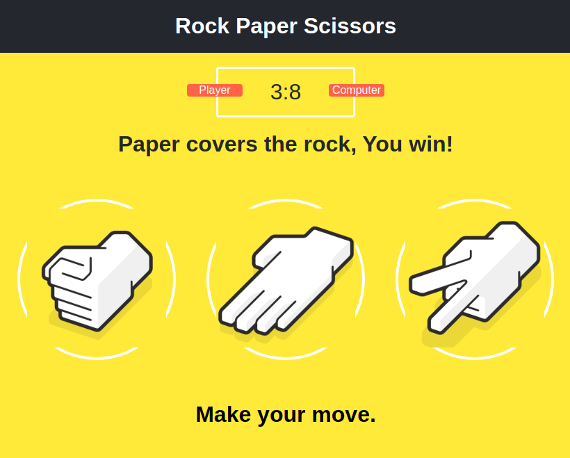

# Rock Paper Scissors Game - JavaScript
This is a fully functional responsive Rock Paper Scissors game in JavaScript.
 
### Languages & tools :
[][vs]
[][js]
  

|Rock Paper Scissors|
|------|
||

### Directory Structure :
    RockPaperScissorsGame-JavaScript
    |
    |-- index.html
    |-- style.css
    |-- script.js
    |
    |-- Img
    |    |-- vscode.png
    |    |-- javascript.svg
    |    |-- rockpaperscissors.png
    |    |-- rock.png
    |    |-- paper.png
    |    |-- scissors.png
    |
    |-- README.md
## Connect with me:  

  
 

[website]: https://abhilashtuofficial.github.io/
[js]: https://github.com/AbhilashTUofficial/JavaScript-programming
[vs]: https://github.com/AbhilashTUofficial/AbhilashTUofficial

